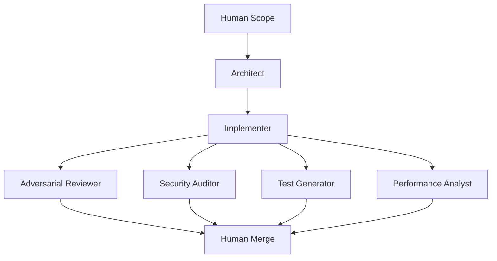

# Ensemble Software Engineering (ESE)

ESE is a lightweight CLI framework for AI-assisted software development using specialized model roles and explicit ensemble constraints.

## Core pipeline



## Installation

```bash
pip install ese-cli
```

## One-Command Local Start

There is now a local GUI: the ESE dashboard.

From the repo root, the simplest way to start everything is:

```bash
./start_ese.sh
```

That script will:
- create `.venv` if needed,
- install/update the package in the virtualenv,
- start the local dashboard GUI.

Other common launcher modes:

```bash
./start_ese.sh task "Prepare a staged rollout plan for billing"
./start_ese.sh pr --base origin/main --head HEAD
./start_ese.sh cli report --artifacts-dir artifacts
```

## Production quickstart

For the fastest path, you can now start from a task description instead of writing config first:

```bash
ese task "Prepare a staged rollout plan for the new billing flow"
```

Use `ese templates` to inspect the built-in task templates.

If you want an explicit saved config, use the original wizard path:

1. Generate a config:

```bash
ese init --advanced
```

The wizard now asks for:
- a real project scope/task,
- whether this should be a `demo` config (`dry-run`, no API calls) or a `live` config,
- provider/model defaults appropriate for that choice,
- selected roles and optional per-role model overrides in advanced mode.

2. Validate configuration and ensemble constraints:

```bash
ese doctor --config ese.config.yaml
```

3. Execute the pipeline:

```bash
ese start --config ese.config.yaml
```

Pass `--artifacts-dir ...` only when you want to override `output.artifacts_dir` from the config.

4. Review outputs:
- `artifacts/ese_summary.md`
- `artifacts/pipeline_state.json`
- `artifacts/ese_config.snapshot.yaml`
- per-role reports in `artifacts/*.json` when `output.enforce_json: true` (default)

`ese run` remains available as a backward-compatible alias for `ese start`.

For ad hoc runs, you can override the saved scope:

```bash
ese start --config ese.config.yaml --scope "Review the release checklist for hidden rollback risks"
```

## Task-First CLI

Opinionated templates:

```bash
ese templates
```

Task-first execution without hand-authoring config:

```bash
ese task "Prepare a safer release workflow" --template release-readiness
```

Pull request review from a local diff or GitHub PR:

```bash
ese pr --repo-path . --base origin/main --head HEAD
```

Or, if you use GitHub CLI:

```bash
ese pr --repo-path . --pr 42
```

This writes the usual run artifacts plus `artifacts/pr_review.md`, a GitHub-ready review summary.

Status and aggregated reporting for an artifacts directory:

```bash
ese status --artifacts-dir artifacts
ese report --artifacts-dir artifacts
```

Rerun from a specific role while reusing upstream artifacts:

```bash
ese rerun implementer --artifacts-dir artifacts
```

Launch the local dashboard:

```bash
ese dashboard --artifacts-dir artifacts
```

The dashboard now supports both task-first runs and PR review runs.

## Role catalog

Use `ese roles` to print the role catalog in the CLI.

- `architect`: System design, decomposition, and interface contracts.
- `implementer`: Code changes and refactors.
- `adversarial_reviewer`: Bug/risk hunting and regression checks.
- `security_auditor`: Threat modeling and vulnerability review.
- `test_generator`: Unit/integration/e2e test generation.
- `performance_analyst`: Latency, memory, and scalability analysis.
- `documentation_writer`: README, API docs, and migration notes.
- `devops_sre`: CI/CD, deploy safety, and observability.
- `database_engineer`: Schema/index/migration correctness.
- `release_manager`: Go/no-go risk assessment and rollout checks.

## Provider/model selection and adapters

Wizard provider presets: `openai`, `anthropic`, `google`, `xai`, `openrouter`, `huggingface`, `local`, `custom_api`.

Built-in runtime adapters:
- `dry-run`: deterministic placeholder artifacts, no API calls.
- `openai`: OpenAI Responses API adapter with retry/timeout handling.
- `custom_api`: Responses-compatible custom provider adapter with validated base URL and auth env var.
- `module:function`: custom Python callable adapter.

When `output.enforce_json: true`, adapters must return valid JSON role reports and `gating.fail_on_high: true` will stop the pipeline on `HIGH` or `CRITICAL` findings.

## Demo vs live setup

- `demo`: writes a safe `dry-run` config using the selected provider/model defaults. This is the prudent path for first-time setup, local walkthroughs, and providers without native live adapters.
- `live`: uses the built-in runtime only for `openai` and `custom_api`.
- Other providers remain available for model selection in the wizard, but live execution requires an explicit `module:function` adapter in advanced mode.

### OpenAI runtime example

```yaml
provider:
  name: openai
  model: gpt-5-mini
  api_key_env: OPENAI_API_KEY
runtime:
  adapter: openai
  timeout_seconds: 60
  max_retries: 2
  retry_backoff_seconds: 1.0
  openai:
    base_url: https://api.openai.com/v1
```

### Custom API runtime example

```yaml
provider:
  name: my-gateway
  model: my-model-id
  api_key_env: CUSTOM_GATEWAY_TOKEN
  base_url: https://gateway.example/v1
runtime:
  adapter: custom_api
  timeout_seconds: 60
  max_retries: 2
  retry_backoff_seconds: 1.0
  custom_api:
    base_url: https://gateway.example/v1
```

## Contract documentation

- Config schema + version policy: [`docs/CONFIG_CONTRACT.md`](docs/CONFIG_CONTRACT.md)
- Pipeline state schema + deterministic role ordering: [`docs/PIPELINE_STATE.md`](docs/PIPELINE_STATE.md)
- Troubleshooting: [`docs/TROUBLESHOOTING.md`](docs/TROUBLESHOOTING.md)
- Contributor CI requirements: [`CONTRIBUTING.md`](CONTRIBUTING.md)
- Release checklist for 1.0.0: [`MILESTONE_1_0_0.md`](MILESTONE_1_0_0.md)
- Changelog: [`CHANGELOG.md`](CHANGELOG.md)
- Release process: [`docs/RELEASE.md`](docs/RELEASE.md)
