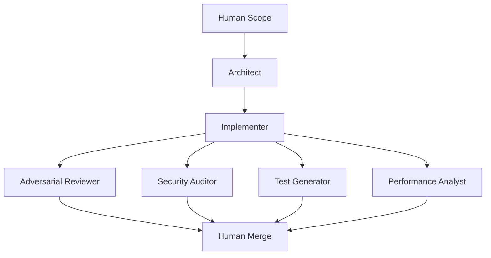

# Ensemble Software Engineering (ESE)

ESE is a lightweight CLI framework for orchestrated AI ensembles. The core engine stays generic, while installed config packs can contribute fixed role catalogs from external repositories.

## Core pipeline



## Installation

```bash
pip install ese-cli
```

Homebrew install from the dedicated tap:

```bash
brew tap Excelsior2026/ese https://github.com/Excelsior2026/homebrew-ese
brew install ese-cli
```

If you want local models via Ollama:

```bash
brew install ollama
brew services start ollama
```

## One-Command Local Start

There is now a local GUI: the ESE dashboard.

From the repo root, the simplest way to start everything is:

```bash
./start_ese.sh
```

That script will:
- create `.venv` if needed,
- install/update the package in the virtualenv,
- start the local dashboard GUI.

If you run a `local`/Ollama-backed workflow through the launcher, it now:
- auto-starts Ollama when it is installed but not running,
- prompts you to install Ollama or switch to a hosted provider when Ollama is missing.

Other common launcher modes:

```bash
./start_ese.sh task "Prepare a staged rollout plan for billing"
./start_ese.sh pr --base origin/main --head HEAD
./start_ese.sh cli report --artifacts-dir artifacts
```

## Production quickstart

For the fastest path, you can now start from a task description instead of writing config first:

```bash
ese task "Prepare a staged rollout plan for the new billing flow"
```

Use `ese templates` to inspect the built-in task templates.

If you want an explicit saved config, use the original wizard path:

1. Generate a config:

```bash
ese init --advanced
```

The wizard now asks for:
- a real project scope/task,
- whether this should be a `demo` config (`dry-run`, no API calls) or a `live` config,
- provider/model defaults appropriate for that choice,
- custom framework roles with starter prompt suggestions and overlap warnings,
- optionally, an installed external pack when one is available locally,
- optional per-role model overrides in advanced mode.

2. Validate configuration and ensemble constraints:

```bash
ese doctor --config ese.config.yaml
```

`ese start`, `ese task`, `ese pr`, and `ese rerun` now enforce the same doctor policy before execution.
Violations fail consistently with exit code `2`, so task-first and PR-review flows cannot bypass ensemble policy checks.

3. Execute the pipeline:

```bash
ese start --config ese.config.yaml
```

Pass `--artifacts-dir ...` only when you want to override `output.artifacts_dir` from the config.
Use `--quiet` on `start`, `task`, `pr`, or `rerun` when you want machine-friendlier output with preflight/follow-up chatter suppressed.

4. Review outputs:
- `artifacts/ese_summary.md`
- `artifacts/pipeline_state.json`
- `artifacts/ese_config.snapshot.yaml`
- per-role reports in `artifacts/*.json` when `output.enforce_json: true` (default)

`ese run` remains available as a backward-compatible alias for `ese start`.

For ad hoc runs, you can override the saved scope:

```bash
ese start --config ese.config.yaml --scope "Review the release checklist for hidden rollback risks"
```

## Task-First CLI

Opinionated templates:

```bash
ese templates
```

Task-first execution without hand-authoring config:

```bash
ese task "Prepare a safer release workflow" --template release-readiness
```

Pull request review from a local diff or GitHub PR:

```bash
ese pr --repo-path . --base origin/main --head HEAD
```

Or, if you use GitHub CLI:

```bash
ese pr --repo-path . --pr 42
```

This writes the usual run artifacts plus `artifacts/pr_review.md`, a GitHub-ready review summary.

Status and aggregated reporting for an artifacts directory:

```bash
ese status --artifacts-dir artifacts
ese status --artifacts-dir artifacts --json
ese report --artifacts-dir artifacts
```

Rerun from a specific role while reusing upstream artifacts:

```bash
ese rerun implementer --artifacts-dir artifacts
```

Reruns now write `start_role` and `parent_run_id` into `pipeline_state.json` so downstream tooling can follow lineage.

Launch the local dashboard:

```bash
ese dashboard --artifacts-dir artifacts
```

The dashboard now supports both task-first runs and PR review runs.

## Governance And Assurance

Baseline ensemble independence is now enforced even when configs omit explicit constraints:
- `architect` and `implementer` must not share a model.
- `implementer` must not share a model with `adversarial_reviewer`, `security_auditor`, or `release_manager`.
- `adversarial_reviewer` and `security_auditor` must not share a model.

Solo mode still runs, but artifacts and reports are marked with `assurance_level: degraded`.
Degraded assurance runs should not be treated as equivalent release evidence to full ensemble runs.

Additional policy knobs are available under `constraints`, including:
- `require_roles`
- `minimum_distinct_models`
- `minimum_specialist_roles`
- `disallow_same_provider_pairs`
- `require_json_for_roles`

Set `strict_config: true` to reject unknown top-level keys and unknown per-role keys outside `provider`, `model`, `temperature`, and `prompt`.

## Prompt Isolation And JSON Contracts

`runtime.review_isolation` controls what specialists and fallback roles can see:
- `framed`
- `implementation_only`
- `scope_only`
- `scope_and_implementation` (default)

When `output.enforce_json: true`, role reports must now include:
- `summary`
- `confidence`
- `assumptions`
- `unknowns`
- `findings`
- `artifacts`
- `next_steps`
- `code_suggestions`

`evidence_basis` is optional and preserved when present.
See `docs/ROLE_REPORT_CONTRACT.md` for the exact schema and semantics.

## Artifact Metadata

Each run now writes lineage and assurance metadata into `pipeline_state.json` and `ese_summary.md`, including:
- `run_id`
- `assurance_level`
- `parent_run_id` for reruns
- `start_role` for reruns
- `state_contract_version`
- `report_contract_version`

## Framework role drafting

Use `ese roles` to print the built-in starter role examples for framework installs.
Use `ese packs` to list installed config packs discovered outside the ESE core package.

- `architect`: System design, decomposition, and interface contracts.
- `implementer`: Code changes and refactors.
- `adversarial_reviewer`: Bug/risk hunting and regression checks.
- `security_auditor`: Threat modeling and vulnerability review.
- `test_generator`: Unit/integration/e2e test generation.
- `performance_analyst`: Latency, memory, and scalability analysis.
- `documentation_writer`: README, API docs, and migration notes.
- `devops_sre`: CI/CD, deploy safety, and observability.
- `database_engineer`: Schema/index/migration correctness.
- `release_manager`: Go/no-go risk assessment and rollout checks.

Framework installs are not limited to those names. The wizard can now generate starter prompts for user-defined roles and warn when responsibilities overlap enough to weaken ensemble independence.

## External Packs

ESE no longer carries domain applications in the core repository. Vertical products should live in sibling repos and register packs through the `ese.config_packs` Python entry point group.

Use `ese packs` to confirm what is installed in the current environment. When no packs are installed, the wizard stays in framework mode automatically.

Scaffold a new external pack project:

```bash
ese pack init ../my-product-pack --key my-product --preset strict
```

Validate the pack manifest and prompt assets:

```bash
ese pack validate ../my-product-pack
ese pack test ../my-product-pack
```

This repository now carries a portable example external pack in [`examples/release_ops_pack`](examples/release_ops_pack).

## External Policy Checks

Installed policy checks can extend `ese doctor` and every preflighted run path (`ese start`, `ese task`, `ese pr`, `ese rerun`) through the `ese.policy_checks` Python entry point group.

Use `ese policies` to list the installed checks in the current environment.

This repository now carries a sample external policy plugin in [`examples/release_policy_plugin`](examples/release_policy_plugin).

## External Reporting Plugins

Installed reporting plugins can extend:

- `ese export` through the `ese.report_exporters` Python entry point group
- the dashboard artifact viewer and run documents through the `ese.artifact_views` Python entry point group

Use `ese exporters` and `ese views` to list what is available in the current environment.

This repository now carries a sample external reporting plugin in [`examples/release_reporting_plugin`](examples/release_reporting_plugin).

## Provider/model selection and adapters

Wizard provider presets: `openai`, `anthropic`, `google`, `xai`, `openrouter`, `huggingface`, `local`, `custom_api`.
If no hosted-provider credentials are detected, the wizard now defaults to `local`, and choosing `local` defaults the execution mode to `live`.

Built-in runtime adapters:
- `dry-run`: deterministic placeholder artifacts, no API calls.
- `openai`: OpenAI Responses API adapter with retry/timeout handling.
- `local`: Ollama-backed local adapter using the OpenAI-compatible endpoint.
- `custom_api`: Responses-compatible custom provider adapter with validated base URL and auth env var.
- `module:function`: custom Python callable adapter.

When `output.enforce_json: true`, adapters must return valid JSON role reports and `gating.fail_on_high: true` will stop the pipeline on `HIGH` or `CRITICAL` findings.
Adapter prompts now use the assembled prompt as the canonical input, with structured context kept separate for tooling/metadata.

## Demo vs live setup

- `demo`: writes a safe `dry-run` config using the selected provider/model defaults. This is the prudent path for first-time setup, local walkthroughs, and providers without native live adapters.
- `live`: uses the built-in runtime for `openai`, `local` (Ollama), and `custom_api`.
- Other providers remain available for model selection in the wizard, but live execution requires an explicit `module:function` adapter in advanced mode.

### Local runtime example

```yaml
provider:
  name: local
  model: qwen2.5-coder:14b
runtime:
  adapter: local
  timeout_seconds: 60
  max_retries: 2
  retry_backoff_seconds: 1.0
  local:
    base_url: http://localhost:11434/v1
    use_openai_compat_auth: true
```

### OpenAI runtime example

```yaml
provider:
  name: openai
  model: gpt-5-mini
  api_key_env: OPENAI_API_KEY
runtime:
  adapter: openai
  timeout_seconds: 60
  max_retries: 2
  retry_backoff_seconds: 1.0
  openai:
    base_url: https://api.openai.com/v1
```

### Custom API runtime example

```yaml
provider:
  name: my-gateway
  model: my-model-id
  api_key_env: CUSTOM_GATEWAY_TOKEN
  base_url: https://gateway.example/v1
runtime:
  adapter: custom_api
  timeout_seconds: 60
  max_retries: 2
  retry_backoff_seconds: 1.0
  custom_api:
    base_url: https://gateway.example/v1
```

## Contract documentation

- Config schema + version policy: [`docs/CONFIG_CONTRACT.md`](docs/CONFIG_CONTRACT.md)
- Extension and pack boundary: [`docs/EXTENSIBILITY.md`](docs/EXTENSIBILITY.md)
- Role report JSON contract: [`docs/ROLE_REPORT_CONTRACT.md`](docs/ROLE_REPORT_CONTRACT.md)
- Pipeline state and lineage contract: [`docs/PIPELINE_STATE.md`](docs/PIPELINE_STATE.md)
- Release evidence guidance: [`docs/RELEASE.md`](docs/RELEASE.md)
- Pipeline state schema + deterministic role ordering: [`docs/PIPELINE_STATE.md`](docs/PIPELINE_STATE.md)
- Troubleshooting: [`docs/TROUBLESHOOTING.md`](docs/TROUBLESHOOTING.md)
- Contributor CI requirements: [`CONTRIBUTING.md`](CONTRIBUTING.md)
- Release checklist for 1.0.0: [`MILESTONE_1_0_0.md`](MILESTONE_1_0_0.md)
- Changelog: [`CHANGELOG.md`](CHANGELOG.md)
- Release process: [`docs/RELEASE.md`](docs/RELEASE.md)
