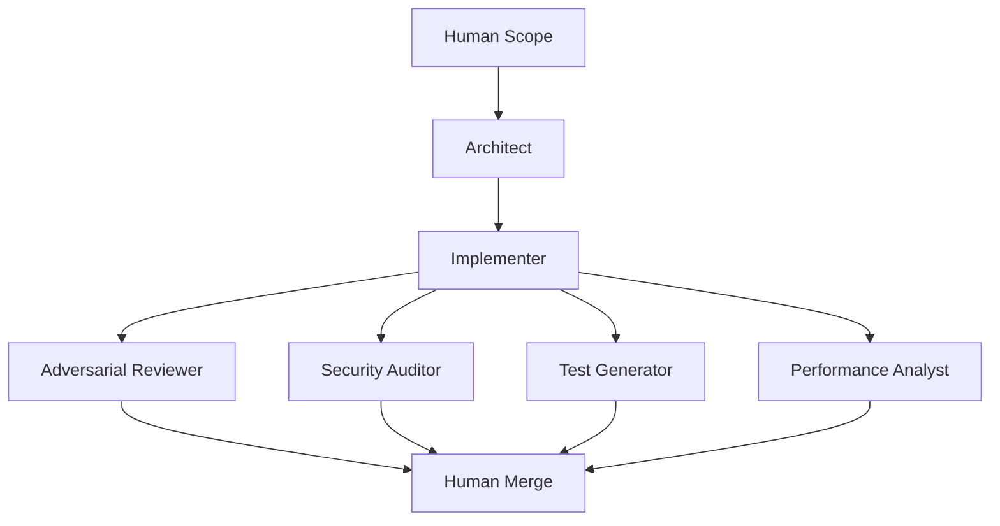

# Ensemble Software Engineering (ESE)

ESE is a lightweight framework for AI-assisted software development using specialized model roles.

## Core pipeline

## Quick start
- Create artifacts for each role stage
- Run the pipeline via CLI
- Review severity findings

## GitHub Actions (optional)
Use `.github/workflows/ese.yml` to run ESE on pull requests.
