# Ensemble Software Engineering (ESE)

ESE is a lightweight framework for AI-assisted software development using specialized model roles.

## Core pipeline

```mermaid
flowchart TD
  A[Human Scope] --> B[Architect]
  B --> C[Implementer]
  C --> D[Adversarial Reviewer]
  C --> E[Security Auditor]
  C --> F[Test Generator]
  C --> G[Performance Analyst]
  D --> H[Human Merge]
  E --> H
  F --> H
  G --> H
```


## Quick start
1. Create a validated config (`version: 1`) with role assignments and constraints.
   `ese init` now includes a role picker (architect, implementer, adversarial_reviewer, security_auditor, test_generator, performance_analyst, documentation_writer, devops_sre, database_engineer, release_manager).
   It also includes provider/model presets for common models, plus a `custom_api` option for custom provider name/base URL/model IDs.
2. Run `ese doctor --config ese.config.yaml` to enforce ensemble separation.
3. Run `ese run --config ese.config.yaml --artifacts-dir artifacts` to execute the pipeline.
4. Review `artifacts/ese_summary.md` and `artifacts/pipeline_state.json`.

`runtime.adapter` defaults to `dry-run` and can be set to `openai` or a custom callable with `module:function`.
Role execution is dynamic from `roles`, so custom roles are supported without source edits.

## Role catalog
- `architect`: System design, decomposition, and interface contracts.
- `implementer`: Code changes and refactors.
- `adversarial_reviewer`: Bug/risk hunting and regression checks.
- `security_auditor`: Threat modeling and vulnerability review.
- `test_generator`: Unit/integration/e2e test generation.
- `performance_analyst`: Latency, memory, and scalability analysis.
- `documentation_writer`: README, API docs, and migration notes.
- `devops_sre`: CI/CD, deploy safety, and observability.
- `database_engineer`: Schema/index/migration correctness.
- `release_manager`: Go/no-go risk assessment and rollout checks.

Use `ese roles` to print this list directly in the CLI.

## Provider and model presets
- Providers with built-in model pickers: `openai`, `anthropic`, `google`, `xai`, `openrouter`, `huggingface`, `local`.
- Each provider includes common model IDs plus `custom (type model id)`.
- `custom_api` lets you enter:
  - custom provider name,
  - optional API base URL,
  - custom model ID,
  - custom API key env var.

## Runtime adapters
- `dry-run`: no external API calls; generates deterministic placeholder artifacts.
- `openai`: calls the OpenAI Responses API with retry/timeout handling.
- `module:function`: custom Python callable adapter.

Example runtime config for real OpenAI execution:

```yaml
provider:
  name: openai
  model: gpt-5-mini
  api_key_env: OPENAI_API_KEY
runtime:
  adapter: openai
  timeout_seconds: 60
  max_retries: 2
  retry_backoff_seconds: 1.0
  openai:
    base_url: https://api.openai.com/v1
```

## GitHub Actions (optional)
Use `.github/workflows/ese.yml` to run ESE on pull requests.

## Roadmap
See [`MILESTONE_1_0_0.md`](MILESTONE_1_0_0.md) for the concrete `1.0.0` release checklist and PR plan.
